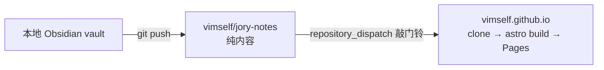

# jory-notes

个人技术知识库。一个纯 Markdown 的 [Obsidian](https://obsidian.md) vault，同时是
[vimself.github.io](https://vimself.github.io) 的内容源 —— 这里没有一行站点代码，博客构建时现拉现渲染。

收录判据只有一句：**半年后的我还会需要这条吗？** 不会就不记。所以库里没有项目细节、
工作记录、日记、待办和原文转载，只有原理、做法、坑和速查。

## 结构

```
计算机/<领域>/<笔记>.md     学科 → 领域 → 笔记，路径恒为三段
草稿箱/                    学习时随手记，规范豁免区，必须扁平
模板/                      笔记骨架
日志/<当周周一>.md          周日志，由 git log 生成
附件/                      图片，平铺
目录.md                    学科与领域边界的唯一权威
CLAUDE.md                  维护规则
```

**「三段路径」是整套设计的地基。** `*/*/*.md` 这个 glob 就是「什么算一篇笔记」的唯一判据：
草稿、模板、日志、附件都只有两段，天然落选。查重、体检、博客发布范围全都建立在它上面，
所以领域下不建第四层目录，草稿箱下不建任何子目录。

顶层每个学科一个文件夹，目前只启用了 `计算机`，下设九个领域：

| 领域 | 收录 |
| --- | --- |
| `编程语言` | 语义、类型系统、内存模型、语言级并发、特性与惯用法 |
| `算法与数据结构` | 算法、数据结构、复杂度分析 |
| `计算机系统` | 操作系统、进程与线程、内存管理、编译与链接、Linux |
| `网络与协议` | TCP/IP、HTTP、TLS、DNS、RPC、网络排错 |
| `数据与存储` | 数据库、SQL、索引、事务、缓存、消息队列 |
| `软件设计` | 架构、设计模式、分布式系统、API 设计 |
| `开发工具链` | Git、Shell、Docker、K8s、CI/CD、构建工具 |
| `人工智能` | LLM、Prompt、Agent、机器学习、AI 工程 |
| `前端与客户端` | 浏览器原理、CSS、前端框架、客户端与移动端 |

现有 16 篇笔记，集中在 `开发工具链`（Git 与 GitHub 一族），其余领域是占位的空目录。
完整的领域边界和易混淆情形见 [目录.md](目录.md)。

## 一篇笔记长什么样

frontmatter 锁死四个键，一个都不多：

```yaml
---
tags: [类型/概念, 技术/Git]
aliases: [Git 分区, 工作区, 暂存区, index, staging area]
created: 2026-08-27
updated: 2026-08-27
---
```

`类型/*` 是封闭集合，只有概念、实践、排错、速查四个值，每篇恰好一个。
`aliases` 不是装饰字段 —— 它是防重复的主承力构件，把「以后可能用来搜它的所有叫法」
都写进去，下次才搜得到，重复笔记才不会诞生。

正文的硬规矩三条：不写 H1（文件名即标题）、frontmatter 之后第一行是引用块形式的一句话结论、
代码块必须标注语言。链接只写 `[[文件名]]` 不写路径，所以笔记换领域不会断链。

## 和博客的关系



方向是「博客拉」，不是「笔记推转换好的 markdown」—— 库里不产生任何生成物，
也就没有生成物与源文件漂移的问题。发布范围同样由路径决定：三段路径即发布，
草稿、模板、日志一律不发布，写作流程一个新步骤都不用加。

站点这一侧在 [vimself/vimself.github.io](https://github.com/vimself/vimself.github.io)。

## 维护

日常的增、改、删、拆、合并由 [Claude Code](https://claude.com/claude-code) 按
[CLAUDE.md](CLAUDE.md) 执行，规则本身也在版本控制里。几个自己搭的关卡：

- **写之前查两次重** —— 通读全部笔记名找语义相近的，再换 2~3 个说法各 grep 一次。重复笔记是这个库最大的风险
- **体检**，八项，更新周日志时顺手跑一遍：缺一句话结论的、标签跑出词表的、碎屑与超长的、草稿滞留过久的，命令都写在 CLAUDE.md 里
- **去 AI 味收尾关卡** —— Stop 钩子拦截，写过笔记的会话必须过一遍 [humanizer-zh](.claude/skills/humanizer-zh/SKILL.md) 检查才能收工

结论被推翻就直接改正、删掉旧结论，不留「~~已废弃~~」和版本对照 ——
历史在 git 里，知识库只回答「现在最好的理解是什么」。
